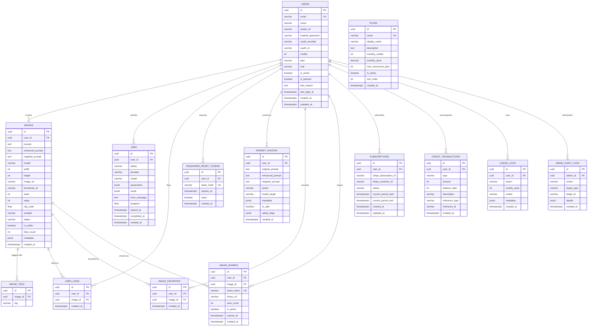

# Database ER Diagram

## Entity Relationship Diagram

## Table Descriptions

### Core Tables

| Table | Purpose | Key Fields |
|-------|---------|------------|
| `users` | User accounts with auth, credits, role | email (unique), hashed_password, credits, role, is_banned |
| `plans` | Subscription plan definitions | name (unique), monthly_credits, monthly_price |
| `images` | Generated image metadata | prompt, model, image_url, is_public, likes_count |
| `jobs` | Image generation job queue | status (PENDING/PROCESSING/COMPLETED/FAILED), progress |

### Auth Tables

| Table | Purpose |
|-------|---------|
| `password_reset_tokens` | Hashed tokens for password reset flow (30min expiry) |

### Social Tables

| Table | Purpose |
|-------|---------|
| `user_likes` | Many-to-many: users ↔ images (public gallery) |
| `image_favorites` | Many-to-many: users ↔ images (private collection) |
| `image_shares` | Shareable links with view counts and expiry |
| `image_tags` | Flexible tagging system for images |

### AI Tables

| Table | Purpose |
|-------|---------|
| `prompt_history` | Log of all prompt enhancements with safety analysis |

### Billing Tables

| Table | Purpose |
|-------|---------|
| `subscriptions` | Stripe subscription tracking |
| `credit_transactions` | Full ledger of credit additions and deductions |
| `usage_logs` | Granular usage analytics (model, action, credits) |

### Admin Tables

| Table | Purpose |
|-------|---------|
| `admin_audit_logs` | Complete audit trail of all admin actions |

## Migration History

| Version | Name | Changes |
|---------|------|---------|
| 001 | initial | users, plans, images, jobs, image_tags, user_likes |
| 002 | auth | password_reset_tokens |
| 003 | prompt_history | prompt_history |
| 004 | favorites_shares | image_favorites, image_shares |
| 005 | billing | subscriptions, credit_transactions, usage_logs |
| 006 | admin | role, is_banned columns on users; admin_audit_logs |
